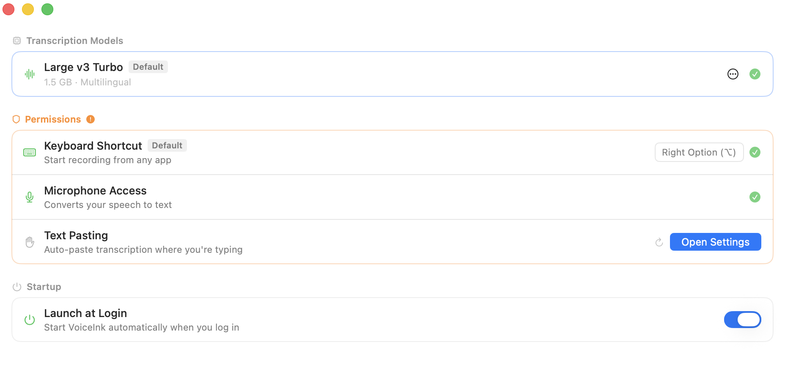

<div align="center">
  
  <h1>VoiceInk Lite</h1>
  <p>Lightweight, opinionated voice-to-text app for macOS focused on core transcription functionality</p>

[](https://www.gnu.org/licenses/gpl-3.0)


</div>

---

VoiceInk Lite is a streamlined version of VoiceInk, focusing on essential voice-to-text functionality without the complexity of AI enhancements. This opinionated build prioritizes simplicity, performance, and privacy.

This lightweight version strips away non-essential features to provide a clean, fast transcription experience for users who want straightforward voice-to-text conversion without additional AI-powered features.



## Get Started

### Install with Homebrew

Run the following command:

```bash
brew install yiweishen/tap/voice-ink
```

### Build from Source

VoiceInk Light is designed to be built from source. Follow the instructions in [BUILDING.md](BUILDING.md) to compile and run the application on your macOS system.

### Create a Release Build (`.app` + `.dmg`)

To build a release-ready `VoiceInk.app` and package it into a `voice-ink.dmg`:

```bash
# 1. Archive the app (unsigned)
xcodebuild -project VoiceInk.xcodeproj \
  -scheme VoiceInk \
  -configuration Release \
  -archivePath /tmp/VoiceInk.xcarchive \
  archive \
  CODE_SIGN_IDENTITY="-" \
  CODE_SIGNING_REQUIRED=NO \
  CODE_SIGNING_ALLOWED=NO

# 2. Copy the app out of the archive
cp -R /tmp/VoiceInk.xcarchive/Products/Applications/VoiceInk.app ./VoiceInk.app

# 3. Create the DMG
hdiutil create \
  -volname "VoiceInk" \
  -srcfolder ./VoiceInk.app \
  -ov \
  -format UDZO \
  ./voice-ink.dmg
```

## Requirements

- macOS 14.0 or later

## Documentation

- [Building from Source](BUILDING.md) - Detailed instructions for building the project
- [Contributing Guidelines](CONTRIBUTING.md) - How to contribute to VoiceInk
- [Code of Conduct](CODE_OF_CONDUCT.md) - Our community standards

## Contributing

We welcome contributions to VoiceInk Light! This project maintains a focused scope on core transcription functionality. Before contributing:

1. Read our [Contributing Guidelines](CONTRIBUTING.md)
2. Open an issue to discuss your proposed changes
3. Ensure contributions align with the lightweight, opinionated nature of this build

For build instructions, see our [Building Guide](BUILDING.md).

## License

This project is licensed under the GNU General Public License v3.0 - see the [LICENSE](LICENSE) file for details.

## Support

If you encounter any issues or have questions, please:

1. Check the existing issues in the GitHub repository
2. Create a new issue if your problem isn't already reported
3. Provide as much detail as possible about your environment and the problem

## Acknowledgments

### Core Technology

- [whisper.cpp](https://github.com/ggerganov/whisper.cpp) - High-performance inference of OpenAI's Whisper model
- [FluidAudio](https://github.com/FluidInference/FluidAudio) - Used for Parakeet model implementation

### Essential Dependencies

- [KeyboardShortcuts](https://github.com/sindresorhus/KeyboardShortcuts) - User-customizable keyboard shortcuts
- [LaunchAtLogin](https://github.com/sindresorhus/LaunchAtLogin) - Launch at login functionality
- [MediaRemoteAdapter](https://github.com/ejbills/mediaremote-adapter) - Media playback control during recording
- [Zip](https://github.com/marmelroy/Zip) - File compression and decompression utilities

---

VoiceInk Lite - A focused, lightweight approach to voice-to-text transcription on macOS.
